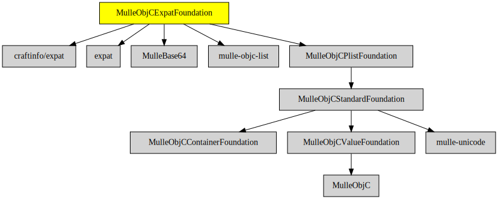

# MulleObjCExpatFoundation

#### 👴🏼 XML parser based on MulleObjCStandardFoundation and libexpat

This adds XML capability for property lists via categories to **NSPropertyListSerialization**.
It uses the expat library.

| Release Version                                       | Release Notes
|-------------------------------------------------------|--------------
|  [](//github.com//MulleObjCExpatFoundation/actions)| [RELEASENOTES](RELEASENOTES.md) |


## Requirements

|   Requirement         | Release Version  | Description
|-----------------------|------------------|---------------
| [expat](https://github.com/libexpat/libexpat) |  [](https://github.com///actions/workflows/mulle-sde-ci.yml) | 
| [MulleFoundationBase](https://github.com/MulleFoundation/MulleFoundationBase) |  [](https://github.com///actions/workflows/mulle-sde-ci.yml) | 🛸 MulleFoundationBase does something
| [MulleBase64](https://github.com/MulleWeb/MulleBase64) |  [](https://github.com///actions/workflows/mulle-sde-ci.yml) | 💬 Decode and encode NSData with base64
| [mulle-objc-list](https://github.com/mulle-objc/mulle-objc-list) |  [](https://github.com///actions/workflows/mulle-sde-ci.yml) | 📒 Lists mulle-objc runtime information contained in executables.

### You are here



## Add

Use [mulle-sde](//github.com/mulle-sde) to add MulleObjCExpatFoundation to your project:

``` sh
mulle-sde add github:MulleFoundation/MulleObjCExpatFoundation
```

## Install

### Install with mulle-sde

Use [mulle-sde](//github.com/mulle-sde) to build and install MulleObjCExpatFoundation and all dependencies:

``` sh
mulle-sde install --prefix /usr/local \
   https://github.com/MulleFoundation/MulleObjCExpatFoundation/archive/latest.tar.gz
```

### Manual Installation

Install the requirements:

| Requirements                                 | Description
|----------------------------------------------|-----------------------
| [expat](https://github.com/libexpat/libexpat)             | 
| [MulleFoundationBase](https://github.com/MulleFoundation/MulleFoundationBase)             | 🛸 MulleFoundationBase does something
| [MulleBase64](https://github.com/MulleWeb/MulleBase64)             | 💬 Decode and encode NSData with base64
| [mulle-objc-list](https://github.com/mulle-objc/mulle-objc-list)             | 📒 Lists mulle-objc runtime information contained in executables.

Install **MulleObjCExpatFoundation** into `/usr/local` with [cmake](https://cmake.org):

``` sh
cmake -B build \
      -DCMAKE_INSTALL_PREFIX=/usr/local \
      -DCMAKE_PREFIX_PATH=/usr/local \
      -DCMAKE_BUILD_TYPE=Release &&
cmake --build build --config Release &&
cmake --install build --config Release
```

## Author

[Nat!](https://mulle-kybernetik.com/weblog) for Mulle kybernetiK


