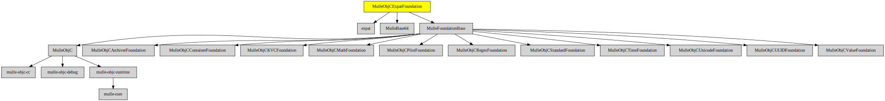

# MulleObjCExpatFoundation

#### 👴🏼 XML parser based on MulleObjCStandardFoundation and libexpat

This adds XML capability for property lists via categories to **NSPropertyListSerialization**.
It uses the expat library.

### You are here

## Install

See [foundation-developer](//github.com/MulleFoundation/foundation-developer) for
installation instructions.

## Author

[Nat!](//www.mulle-kybernetik.com/weblog) for
[Mulle kybernetiK](//www.mulle-kybernetik.com) and
[Codeon GmbH](//www.codeon.de)
